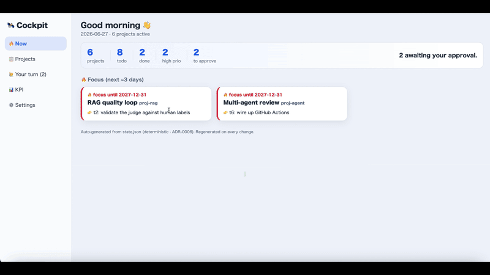

# 🛰 Cockpit

**A deterministic HITL sync layer between you and your coding agent.**
Keep yourself and your AI agent (e.g. Claude Code) looking at the *same* project state — without
drift, without burning tokens, and without letting the agent silently change the truth.

No dependencies. If Python runs, this runs.




---

## What is it (30 seconds)

You juggle several projects, and you also hand work to an AI coding agent. Cockpit is a tiny
project tracker with one twist:

> **The human and the agent share one ledger. The agent can only *propose*; the human *approves*.**

- **You** look at a dashboard, approve proposals, mark your work done.
- **The agent** reads a small *snapshot* to understand status, and proposes new tasks.
- The ledger (the source of truth) is **one JSON file**. Everything else is generated from it.

No server required (optional), no database, no login.

## Why this shape

Working with an AI agent creates three recurring problems. Cockpit answers each with one choice:

| Problem | Answer |
| --- | --- |
| **Drift** — the agent's view diverges from how you track things | One ledger: `state.json`. Both sides resolve to it. |
| **Token waste** — re-reading full state every time is expensive | The agent reads only a compact `snapshot.md`. |
| **Agent overreach** — it marks things done / invents tasks | The agent can only **propose**; humans **approve** (HITL gate). |

And the underlying rule: **canonical state is written by deterministic code, never by an LLM.**
The agent lives at the edges (reads the snapshot, proposes); plain Python writes the truth.
See [DESIGN.md](DESIGN.md) for the reasoning.

## The files

```
cockpit.py          # the tool (read/write the ledger via commands)
serve.py            # optional: a tiny local server for 1-click approval in the browser
eval.py             # self-test: drift=0, HITL gate, token reduction
eval_dashboard.py   # self-test: invariants on the generated HTML
state.example.json  # sample data (copied to state.json on first run)
DESIGN.md           # why it works this way

# generated / gitignored (created on first run):
state.json          # ★ the source of truth
snapshot.md         # what the agent reads (compact, read-only)
dashboard.html      # what you look at
```

Remember one thing: **`state.json` is the truth; `snapshot.md` and `dashboard.html` are outputs.**
Editing the outputs does nothing — change state through the commands below.

## Requirements

- Python 3.8+ (`python3 --version`). That's it — **no external packages**.

## Quick start

```bash
git clone <repo> && cd cockpit

python3 cockpit.py dashboard     # first run copies state.example.json -> state.json, builds dashboard.html
open dashboard.html              # macOS (use `start` on Windows, `xdg-open` on Linux)

python3 cockpit.py snapshot      # the compact, agent-facing view
python3 cockpit.py now           # what's hot in the next ~3 days
```

The dashboard's left menu switches between **Now / Projects / Your turn / KPI / Settings**.

## Concepts

- **Project** — one effort. Has an `id`, `name`, a goal (`north_star`), priority, etc.
- **Phase (the Journey bar)** — a project's path: `✅ done → ● you-are-here → ○ future → 🏁 goal`.
  The point is to see *where you are and where the finish line is* at a glance.
- **Task** with a **status**:

  | status | meaning | who sets it |
  | --- | --- | --- |
  | `todo` | to do | human |
  | `done` | finished | human |
  | `skip` | no longer needed | human |
  | `dropped` | cancelled | human |
  | `proposed` | **the agent's proposal (awaiting approval)** | agent only |

- **owner** — `human` (👤) or `ai` (🤖). An approved `owner=ai` todo becomes the **agent's inbox**.
- **priority** — `high` 🔴 / `mid` 🟡 / `low` ⚪.
- **focus** — flag a project "hot" for a few days even if nothing is due.

## The approval loop (the heart of it)

Three lanes, all projections of `owner × status` — think **outbox ↔ inbox**:

```
🟡 Awaiting approval  (proposed)            -> you approve
✅ Your tasks         (human + todo)        -> you do
🤖 Ready for the agent (ai + todo)          -> the agent does
```

1. **Agent proposes:** `python3 cockpit.py propose proj-rag "implement hybrid search"` → `proposed`.
2. **You approve:** `python3 cockpit.py approve t8` (or the [✅ Approve] button) → becomes an `ai` todo.
3. **It reaches the agent:** the task now shows under **"Ready for the agent"** in `snapshot.md`.

The agent can never promote its own work — your approval is the GO signal.

## Command reference

```bash
# view
python3 cockpit.py snapshot                 # compact view (writes snapshot.md)
python3 cockpit.py dashboard                # human HTML (writes dashboard.html)
python3 cockpit.py now [days]               # what's hot in the next N days (default 3)
python3 cockpit.py detail proj-rag          # deep view of one project
python3 cockpit.py list                     # all tasks

# create
python3 cockpit.py add-project proj-1 "My project" "The goal" high
python3 cockpit.py add-phase   proj-1 "Phase 0" "first milestone"
python3 cockpit.py add         proj-1 "my own task" mid     # your task (owner human, todo)

# human confirms (HITL)
python3 cockpit.py approve t8                # proposal -> todo
python3 cockpit.py reject  t8                # proposal -> dropped
python3 cockpit.py set-status  t8 done       # todo | done | skip | dropped
python3 cockpit.py set-priority proj-1 high
python3 cockpit.py set-phase    proj-1 1 done   # advance the Journey (0-based)
python3 cockpit.py focus proj-1 5            # hot for 5 days  (unfocus to clear)

# agent proposes (only)
python3 cockpit.py propose proj-1 "a task it suggests"

# housekeeping
python3 cockpit.py validate                  # check the ledger for errors
```

## Optional: 1-click approval in the browser

```bash
python3 cockpit.py serve            # http://127.0.0.1:8765  (Ctrl+C to stop)
```

Open `http://127.0.0.1:8765` and the cards get **[✅ Approve] [🗑 Reject] [Done] [✅ Complete phase]**
buttons. Clicking updates `state.json` and regenerates the page — so approval reaches the agent's
inbox immediately. Standard library only; binds `127.0.0.1` (local only). Without the server, just
open `dashboard.html` (the buttons become copy-paste commands — nothing breaks).

## Wiring your agent

Tell your agent (in its instructions/system file):

- Read **`snapshot.md`** for project state — not the whole `state.json` (saves tokens).
- To add/change a task, **propose only**: `python3 cockpit.py propose <pid> "<desc>"`.
- A human confirms with `approve` / `set-status`. After approval the task shows under
  **"Ready for the agent"** in the snapshot — that's the inbox.

## Data model (`state.json`)

```jsonc
{
  "projects": [{
    "id": "proj-rag",
    "name": "RAG quality loop",
    "north_star": "Build a loop that measures and improves RAG answer quality",
    "priority": "high",                 // high | mid | low
    "repo": "rag/",
    "depends_on": [],
    "done_def": "A score-over-time chart is demoable",   // 🏁
    "phases":   [{ "name": "Phase 0 eval loop", "goal": "...", "status": "done" }],
    "milestones": [{ "name": "demo", "due": "2026-07-15", "status": "todo" }],
    "tasks": [{ "id": "t1", "desc": "...", "status": "todo", "owner": "human" }]
  }]
}
```

> Edit via commands, not by hand — hand-editing is error-prone and defeats the deterministic design.

## Tests

```bash
python3 eval.py             # drift=0 round-trip, HITL gate, token reduction
python3 eval_dashboard.py   # invariants on the rendered HTML
```

Both run in CI on every push (`.github/workflows/ci.yml`). See [DESIGN.md](DESIGN.md) for what
each eval proves and why the checks are structural.

## FAQ

- **Is my data sent anywhere?** No. Everything is local files. The optional server binds `127.0.0.1` only.
- **Does it work without an AI agent?** Yes — it's a fine lightweight project tracker on its own.
- **Multiple users / concurrent edits?** Single-user by design; swap the store for SQLite behind the
  same deterministic API if you need it.

## License

[MIT](LICENSE) © 2026 Ryota Asai
